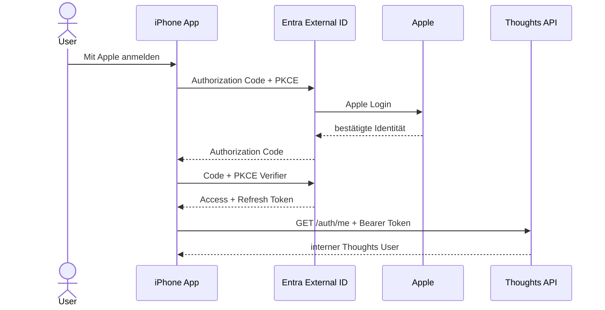

# Apple-Login im Frontend

Die App hat zwei bewusst getrennte Betriebsarten:

- `local`: kein Login; der bisherige Mac-/Tailscale-Workflow bleibt aktiv.
- `azure`: Entra External ID ist vorgeschaltet und nur Apple wird als
  Identity Provider angeboten.

## Ablauf



Das Refresh-Token liegt im iOS-Keychain (`expo-secure-store`). Das kurzlebige
Access-Token bleibt im Speicher und wird bei Bedarf erneuert. Die App enthält
kein Client-Secret. Im Azure-Modus senden alle Requests an `/recordings` und
`/auth/me` das Access-Token als Bearer Token. Bei einer abgelaufenen oder
ungültigen Session wird der lokale Login entfernt und die Loginseite angezeigt.

Das Frontend berücksichtigt außerdem `DELETE /auth/me` als Grundlage für die
spätere Funktion zum Löschen des Kontos.

## Lokaler Modus

```env
EXPO_PUBLIC_THOUGHTS_DATA_MODE=local
EXPO_PUBLIC_THOUGHTS_UPLOAD_URL=https://your-mac.your-tailnet.ts.net
```

## Azure-Modus

Die benötigten Werte stehen in `.env.example`. Danach:

```env
EXPO_PUBLIC_THOUGHTS_DATA_MODE=azure
```

Für den Redirect muss ein Development-/Production-Build der App verwendet
werden; Expo Go besitzt das benutzerdefinierte URL-Scheme nicht.

## Noch einmalig im Portal

1. External-ID-Tenant und die App-Registrierungen `thoughts-ios` und
   `thoughts-api` anlegen.
2. Beim iOS-Client `msauth.com.otto.thoughts://auth` als Redirect URI
   registrieren.
3. Den API-Scope `recordings.readwrite` freigeben und dem iOS-Client erlauben.
4. Apple als Identity Provider konfigurieren und als einzigen Provider zum
   User Flow hinzufügen.
5. Backend auf `THOUGHTS_AUTH_MODE=entra` und Frontend auf
   `EXPO_PUBLIC_THOUGHTS_DATA_MODE=azure` umstellen.

Die Apple-Konfiguration benötigt im Apple Developer Portal die App ID
`com.otto.thoughts`, eine Services ID, Team ID, Key ID und den `.p8`-Key.
