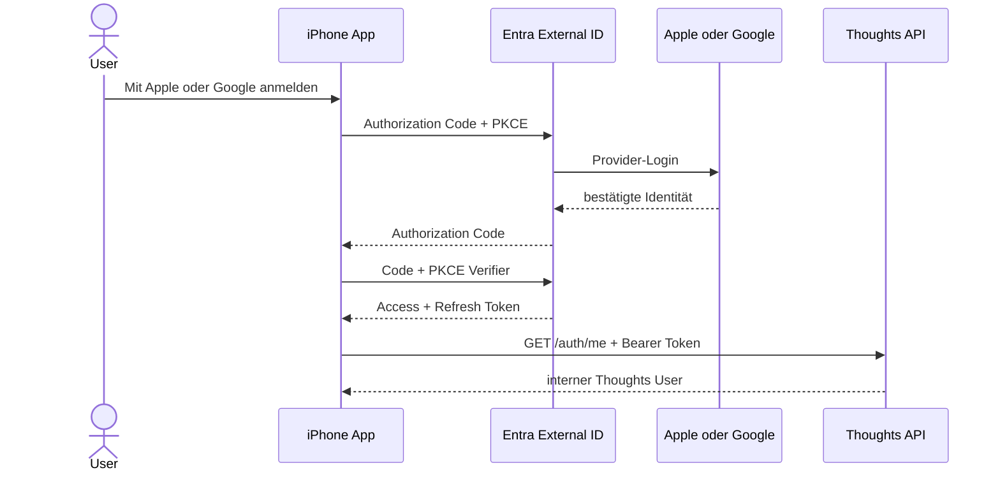

# Apple- und Google-Login im Frontend

Die App verwendet ausschließlich das authentifizierte Azure-Backend. Entra
External ID ist vorgeschaltet; Apple und Google werden als Identity Provider
angeboten. Einen lokalen Receiver- oder unauthentifizierten Fallback gibt es
im Frontend nicht.

## Ablauf

Das Refresh-Token liegt im iOS-Keychain (`expo-secure-store`). Das kurzlebige
Access-Token bleibt im Speicher und wird bei Bedarf erneuert. Die App enthält
kein Client-Secret. Im Azure-Modus senden alle Requests an `/recordings` und
`/auth/me` das Access-Token als Bearer Token. Bei einer abgelaufenen oder
ungültigen Session wird der lokale Login entfernt und die Loginseite angezeigt.

Das Frontend berücksichtigt außerdem `DELETE /auth/me` als Grundlage für die
spätere Funktion zum Löschen des Kontos.

## Konfiguration

Die benötigten Azure- und Entra-Werte stehen in `.env.example`.

Für den Redirect muss ein Development-/Production-Build der App verwendet
werden; Expo Go besitzt das benutzerdefinierte URL-Scheme nicht.

## Noch einmalig im Portal

1. External-ID-Tenant und die App-Registrierungen `thoughts-ios` und
   `thoughts-api` anlegen.
2. Beim iOS-Client `msauth.com.otto.thoughts://auth` als Redirect URI
   registrieren.
3. Den API-Scope `recordings.readwrite` freigeben und dem iOS-Client erlauben.
4. Apple und Google als Identity Provider konfigurieren und zum User Flow
   hinzufügen.
5. Backend mit aktivierter Entra-Authentifizierung deployen und die
   Produktionswerte aus `.env.example` im Frontend setzen.

Die Apple-Konfiguration benötigt im Apple Developer Portal die App ID
`com.otto.thoughts`, eine Services ID, Team ID, Key ID und den `.p8`-Key.
Google benötigt eine für Entra konfigurierte Client ID samt Client Secret.
