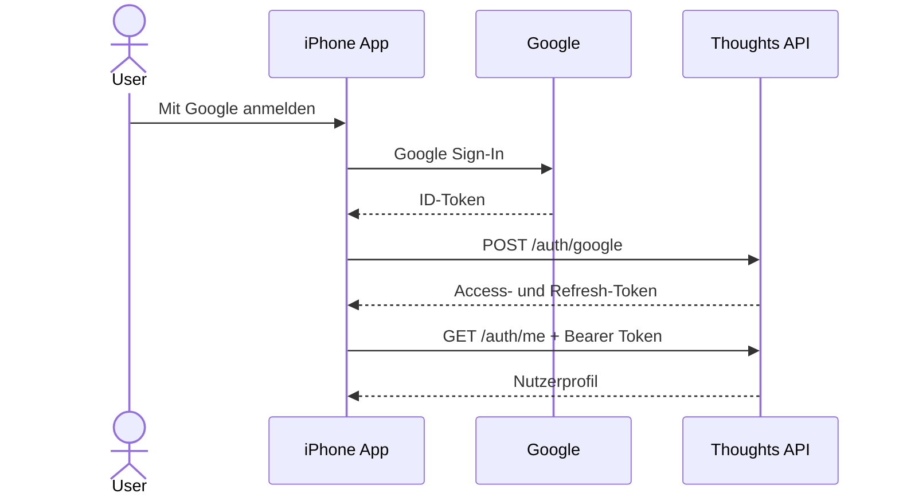

# Anmeldung

Die App meldet Nutzer direkt mit Google an. Das Google-ID-Token wird vom
Thoughts-Backend geprüft und gegen eine interne Sitzung getauscht. Apple-Login
ist vorbereitet, aber noch nicht verfügbar.

## Ablauf

Das Refresh-Token liegt im iOS-Keychain (`expo-secure-store`). Das kurzlebige
Access-Token bleibt im Speicher und wird über `/auth/refresh` erneuert. Bei einer
ungültigen Sitzung werden die lokalen Anmeldedaten entfernt.

## Konfiguration

Benötigt werden `EXPO_PUBLIC_THOUGHTS_API_URL`,
`EXPO_PUBLIC_GOOGLE_IOS_CLIENT_ID` und `EXPO_PUBLIC_GOOGLE_WEB_CLIENT_ID`.
Die App enthält kein Client-Secret.
